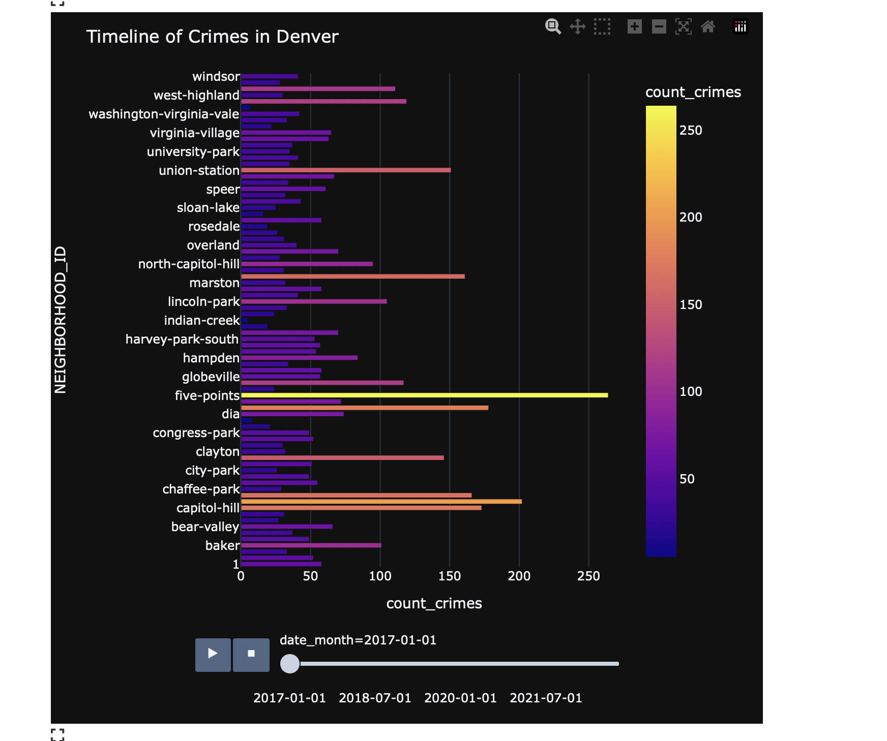

# Denver crimes dashboard

This is a simple dashboard made with Dash and Plotly (for the frontend) and Apache Spark (for the backend). The dashboard shows some analysis of the Denver crimes data, which can be found here:

        https://www.kaggle.com/datasets/paultimothymooney/denver-crime-data
    
The dashboard also includes a little experiment to make a double update on a component (this solution can be used to return an intermediate result for long callback).

This is some examples 

<!-- add an image from imgs folder-->

